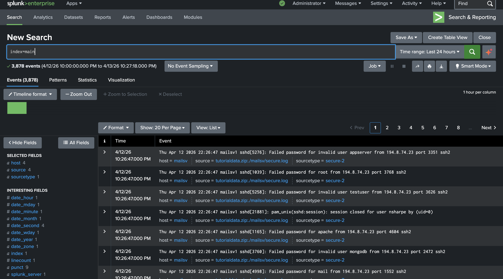
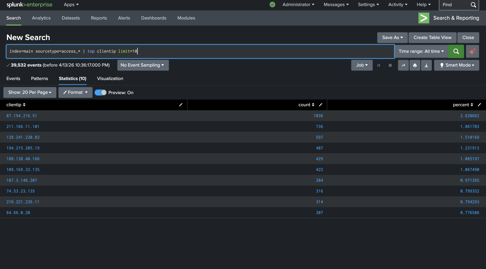
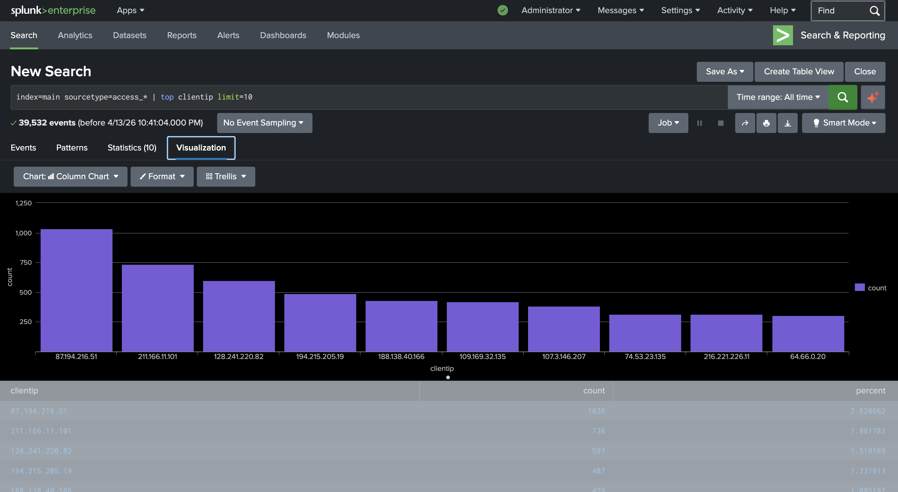
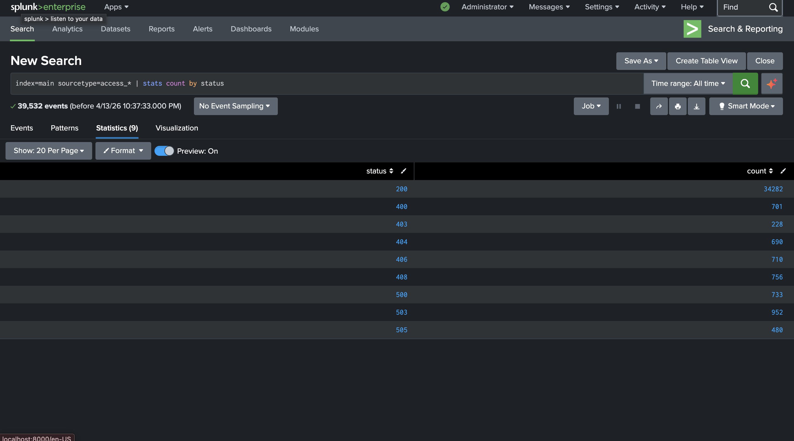
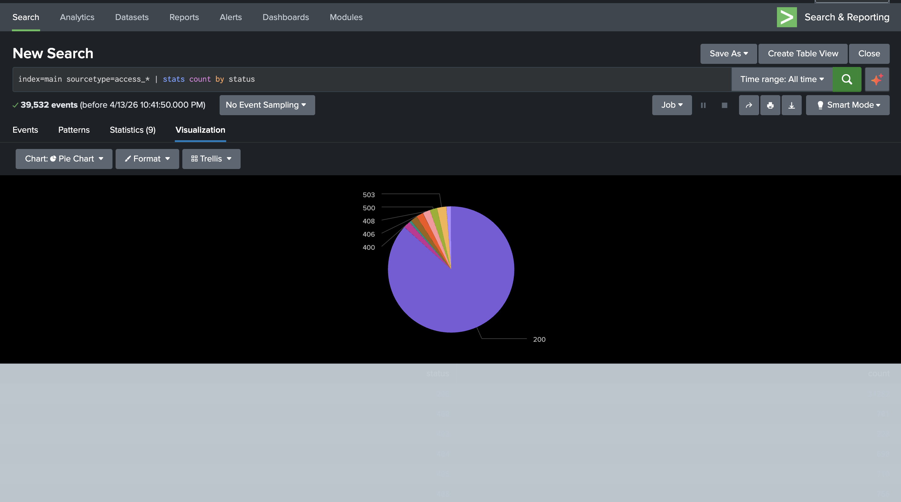
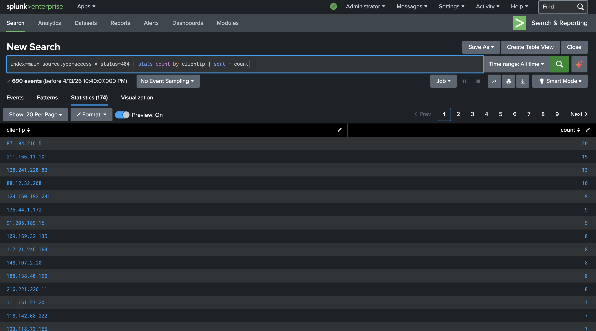
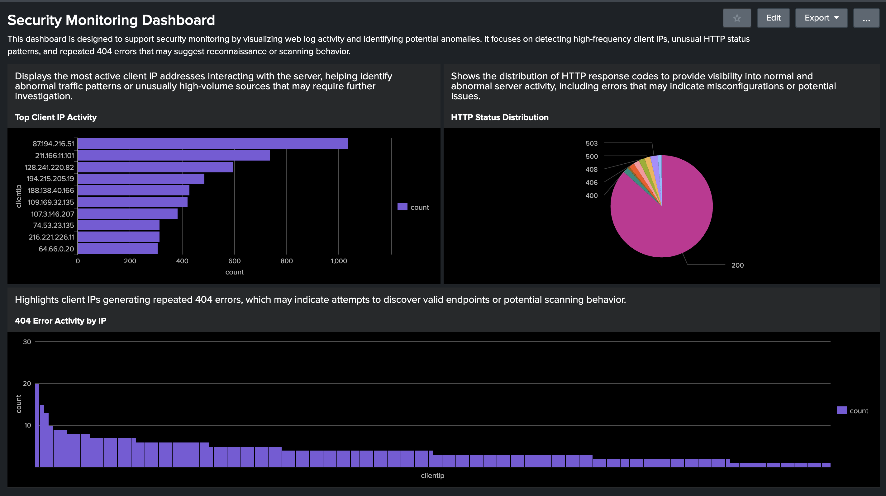

# SIEM Log Analysis with Splunk

## Overview
This project demonstrates security monitoring and log analysis using Splunk SIEM. The goal was to ingest web log data, perform searches, identify potentially suspicious activity, and visualize findings through a security dashboard.

## Objectives
- Ingest log data into Splunk
- Perform SPL (Search Processing Language) queries
- Identify abnormal traffic patterns
- Detect potential scanning activity
- Create visual dashboards for monitoring

## Environment
- Splunk Enterprise
- Splunk Web (localhost)
- Sample web log dataset

## Log Analysis Process

### Raw Log Search
Initial search to confirm data ingestion and view raw log events.

---

### Top Client IP Analysis
Identified the most active client IP addresses interacting with the server.

---

### HTTP Status Code Analysis
Analyzed HTTP response codes to understand normal vs abnormal server activity.

---

### 404 Error Investigation
Identified IP addresses generating repeated 404 errors, which may indicate scanning or reconnaissance behavior.

---

## Security Monitoring Dashboard

A dashboard was created to visualize key security metrics and support monitoring.

---

## Key Findings
- A small number of IP addresses generated the majority of traffic
- Repeated 404 errors were observed from specific IPs, indicating potential probing behavior
- HTTP status distribution showed predominantly normal traffic with some error patterns

## Skills Demonstrated
- SIEM fundamentals
- Log ingestion and analysis
- SPL querying
- Security monitoring concepts
- Data visualization and reporting
